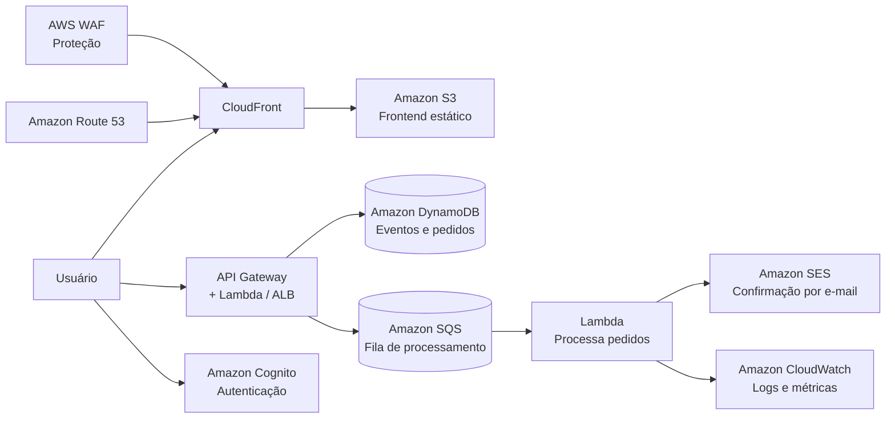

# Loja virtual de ingressos para jogos de futebol

Projeto de referência para uma loja virtual de ingressos de jogos de futebol no estádio, seguindo o modelo de arquitetura em nuvem da Amazon (AWS).

## Visão geral

A plataforma permite:

- listar jogos e disponibilidade de ingressos;
- selecionar assentos e quantidade;
- processar compra com confirmação de pagamento;
- enviar confirmação por e-mail;
- manter inventário de ingressos em tempo real;
- escalar para alta demanda em dias de jogo.

## Arquitetura proposta na AWS



## Componentes principais

- Front-end estático: Amazon S3 + CloudFront
- Autenticação: Amazon Cognito
- API de compras: Amazon API Gateway + AWS Lambda ou Amazon ECS/Fargate
- Banco de dados: Amazon DynamoDB
- Fila assíncrona: Amazon SQS
- Notificação por e-mail: Amazon SES
- Monitoramento: Amazon CloudWatch + X-Ray
- Proteção: AWS WAF
- DNS: Amazon Route 53

## Fluxo funcional

1. Usuário acessa a loja e navega pelos jogos disponíveis.
2. Seleciona o estádio, a categoria do ingresso e a quantidade.
3. Sistema valida disponibilidade do inventário.
4. Pedido é registrado no banco de dados.
5. Mensagem entra na fila de processamento assíncrono.
6. Serviço de processamento confirma pagamento e atualiza estoque.
7. E-mail de confirmação é enviado ao cliente.
8. Usuário recebe acesso à confirmação da compra.

## Estrutura do projeto

- `backend/`: API para disponibilizar eventos e processar a compra
- `frontend/`: interface da loja virtual
- `infra/`: proposta de infraestrutura em nuvem para AWS
- `README.md`: documentação do projeto

## Como executar localmente

### Backend

```bash
cd backend
npm install
npm start
```

A API estará disponível em `http://localhost:3000`.

### Front-end

Abra o arquivo `frontend/index.html` diretamente no navegador, ou sirva a pasta com um servidor estático.

## Endpoints da API

- `GET /health` – saúde da aplicação
- `GET /events` – lista de jogos disponíveis
- `POST /orders` – criação de pedido

## Tecnologias sugeridas

- Node.js + Express para a API
- HTML + CSS + JavaScript para a interface
- AWS Lambda para processamento online/assíncrono
- DynamoDB para armazenamento
- CloudFront + S3 para entrega do front-end

## Próximos passos

- adicionar autenticação via Cognito;
- integrar com gateway de pagamento;
- criar filas e processamento assíncrono com SQS;
- configurar deploy automatizado com CI/CD;
- preparar infraestrutura com Terraform ou AWS CDK.
