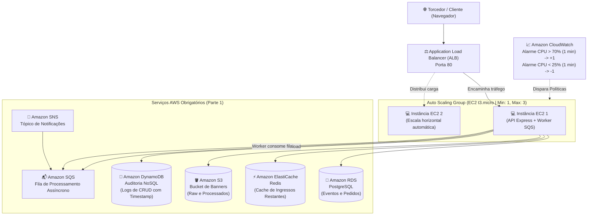

# Loja de Ingressos para Jogos de Futebol - AWS Cloud

Trabalho Prático 1 da disciplina **Desenvolvimento de Software para Nuvem (UFC)**  
**Professores:** Dr. Paulo A. L. Rego e Dr. Fernando Antonio Mota Trinta  

---

## 🎯 Visão Geral

Plataforma de alta disponibilidade e elasticidade na nuvem AWS para venda de ingressos de jogos de futebol, implementando controle atômico de concorrência, camada de cache distribuído em memória, processamento assíncrono de banners e auditoria completa em banco NoSQL.

---

## 🏛️ Arquitetura na Nuvem AWS

A infraestrutura foi desenhada e provisionada em conformidade com as **duas partes** solicitadas na especificação do trabalho:



---

## 📋 Conformidade com os Requisitos do Trabalho

| Requisito do Trabalho | Serviço AWS Utilizado | Como foi implementado |
| :--- | :--- | :--- |
| **1. Execução na EC2** | Amazon EC2 | Aplicação Node.js rodando em instâncias EC2 (`t3.micro`) configuradas via `systemd` e `user_data`. |
| **2. Banco Relacional** | Amazon RDS (PostgreSQL) | Persistência de eventos e pedidos com transações atômicas de concorrência garantindo que torcedores não comprem o mesmo assento. |
| **3. Arquivo Binário** | Amazon S3 | Armazenamento dos banners oficiais dos jogos (`banners/raw/`) e dos thumbnails otimizados (`banners/processed/`). |
| **4. Cache em Memória** | Amazon ElastiCache (Redis) | Cache acelerador de alta frequência para a listagem de jogos e estoque disponível (`events:list`), invalidado a cada nova compra. |
| **5. Auditoria NoSQL** | Amazon DynamoDB | Registro de todas as operações de CRUD (`CREATE`, `READ`, `UPDATE`, `DELETE`, `ORDER`, `PROCESS_BANNER`) com tipo de ação, dados manipulados e timestamp. |
| **6. Desacoplamento Assíncrono** | Amazon SNS / SQS | Webservice recebe o banner e responde `201 Created` imediatamente. O processamento pesado de rescaling com `sharp` é realizado pelo **Worker** desacoplado (`worker.js`). |
| **Parte 2: Elasticidade Horizontal** | ALB + Auto Scaling Group | Balanceador de carga à frente de 1 a 3 instâncias com regras de escalabilidade por CPU (>70% escala +1, <25% escala -1 por mais de 1 minuto). |

---

## 📂 Estrutura do Repositório

```text
├── backend/
│   ├── server.js            # Webservice principal da API e rotas de eventos/pedidos
│   ├── worker.js            # Worker desacoplado que consome fila SQS e processa imagens
│   ├── schema.sql           # Esquema relacional para PostgreSQL (RDS)
│   ├── test-api.test.js     # Testes automatizados da API e do Worker (Node test runner)
│   └── package.json         # Dependências (Express, pg, redis, sharp, aws-sdk)
├── frontend/
│   ├── index.html           # Interface web com monitor AWS, vitrine, checkout e auditoria
│   ├── app.js               # Integração assíncrona, CRUD completo e testes de estresse
│   └── styles.css           # Estilização moderna e responsiva
├── infra/
│   ├── main.tf              # Provisionamento completo em Terraform (ALB, ASG, RDS, Cache, S3, DynamoDB, SQS)
│   ├── variables.tf         # Declaração de variáveis
│   ├── outputs.tf           # Saídas da infraestrutura (URL do ALB, endpoints dos bancos)
│   ├── user_data.sh.tpl     # Script de bootstrap automatizado para a EC2
│   ├── terraform.tfvars.example # Exemplo de configuração
│   └── README.md            # Documentação da infraestrutura e roteiro de gravação do vídeo
├── docker-compose.yml       # Ambiente local com PostgreSQL e Redis para testes
└── README.md                # Este documento
```

---

## 💻 Como Executar Localmente

### 1. Iniciar Banco e Cache Locais (Opcional)
Se desejar testar com PostgreSQL e Redis locais via Docker:
```bash
docker compose up -d
```

### 2. Rodar a API e o Worker
```bash
cd backend
npm install

# Em um terminal, inicie a API:
npm start

# Em outro terminal, inicie o Worker desacoplado de fila:
npm run worker
```

Acesse a interface no navegador em: `http://localhost:3000`

### 3. Rodar os Testes Automatizados
```bash
cd backend
npm test
```
*Executa 7 testes cobrindo todas as rotas da API, healthcheck dos 6 serviços, compras concorrentes, logs do DynamoDB e processamento desacoplado do Worker.*

---

## ☁️ Como Fazer o Deploy na AWS (Terraform)

Para subir a infraestrutura completa na nuvem e obter a URL do Application Load Balancer:

```bash
cd infra
cp terraform.tfvars.example terraform.tfvars
terraform init
terraform plan
terraform apply -auto-approve
```

O Terraform imprimirá a URL pública da aplicação:
```bash
application_url = "http://stadium-tickets-alb-XXXXX.us-east-1.elb.amazonaws.com"
```

---

## 🎥 Demonstração da Parte 2 (Vídeo do Auto Scaling)

A especificação do trabalho exige um vídeo demonstrando o Auto Scaling respondendo à carga:
1. Acesse a aplicação pela URL do Load Balancer.
2. Na seção **"⚡ Teste de Elasticidade & Auto Scaling"**, selecione a duração de **75 segundos** e clique em **"🔥 Iniciar Carga de CPU"**.
3. No console da AWS, acompanhe:
   - A CPU média subindo acima de 70% por 1 minuto.
   - O alarme do **CloudWatch** disparando a política de Scale-Out.
   - O **Auto Scaling Group** criando uma nova instância EC2 e registrando-a no Target Group do ALB.
   - Após o término do teste, a CPU caindo abaixo de 25% e o Auto Scaling encerrando a instância excedente.
