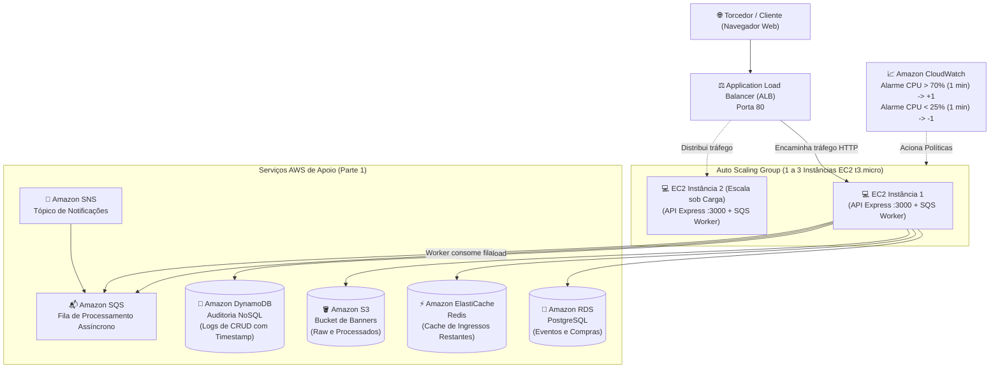

# Infraestrutura em Nuvem AWS - Loja de Ingressos (UFC)

Projeto de infraestrutura com **Terraform** desenvolvido para o **Trabalho Prático 1** da disciplina **Desenvolvimento de Software para Nuvem (UFC)**, ministrada pelos professores Dr. Paulo A. L. Rego e Dr. Fernando Antonio Mota Trinta.

---

## 🏗️ Arquitetura Provisionada



---

## 📋 Atendimento aos Requisitos da Especificação

### Parte 1 - Os 6 Serviços AWS Obrigatórios
1. **EC2:** Aplicação Web e API executando em instâncias EC2 (`t3.micro`), inicializadas com script `user_data` que sobe a API Express e o Worker via `systemd`.
2. **Amazon RDS (PostgreSQL):** Banco relacional para dados de eventos e compras de ingressos com controle transacional de concorrência (`db.t3.micro`).
3. **Amazon S3:** Armazenamento de arquivos binários (upload dos banners oficiais dos jogos em `banners/raw/` e banners redimensionados em `banners/processed/`).
4. **Amazon ElastiCache (Redis):** Camada de cache em memória para consultas de alta frequência (`events:list`), reduzindo o consumo de banco e atualizada a cada compra.
5. **Amazon DynamoDB:** Banco NoSQL para log de auditoria obrigatório de todas as operações de CRUD (`CREATE`, `READ`, `UPDATE`, `DELETE`, `ORDER`, `PROCESS_BANNER`), contendo ID, ação, dados manipulados e timestamp.
6. **Amazon SQS / SNS (Desacoplamento):** Quando um evento é cadastrado com imagem, a API grava a imagem bruta no S3 e enfileira uma mensagem no SQS. O **Worker** (`worker.js`) roda em processo separado, consome a mensagem da fila, aplica o redimensionamento com a biblioteca `sharp`, salva o thumbnail no S3 e atualiza o RDS.

### Parte 2 - Elasticidade e Auto Scaling
* **Application Load Balancer (ALB):** À frente das instâncias distribuindo a carga de trabalho, com health check periódico na rota `/health`.
* **Capacidade:** Inicia com **1 instância** (`min_size = 1`, `desired = 1`) e pode crescer até no máximo **3 instâncias** (`max_size = 3`).
* **Regra c) Scale Out:** Se a média de CPU das instâncias exceder **70% por mais de 1 minuto**, uma nova instância é criada.
* **Regra d) Scale In:** Se a média de CPU cair abaixo de **25% por mais de 1 minuto**, uma instância excedente é encerrada.

---

## 🚀 Como Fazer o Deploy com Terraform

### 1. Pré-requisitos
* Terraform instalado (>= 1.5.0)
* AWS CLI configurado com credenciais (`aws configure`)

### 2. Configurar Variáveis
Copie o arquivo de exemplo:
```bash
cp terraform.tfvars.example terraform.tfvars
```
Edite o `terraform.tfvars` caso queira customizar a senha do RDS ou a região.

> [!TIP]
> **Se você estiver usando o AWS Academy Learner Lab:**
> Descomente as linhas no `terraform.tfvars`:
> ```hcl
> use_existing_lab_role = true
> lab_role_name         = "LabRole"
> ```

### 3. Provisionar a Infraestrutura
```bash
cd infra
terraform init
terraform plan
terraform apply -auto-approve
```

Ao finalizar, o Terraform exibirá as saídas (`outputs`), incluindo o link do balanceador:
```bash
application_url = "http://stadium-tickets-alb-XXXXX.us-east-1.elb.amazonaws.com"
```

Acesse esse endereço no seu navegador para utilizar a loja de ingressos!

---

## 🎥 Roteiro para Gravação do Vídeo da Parte 2

A especificação do trabalho exige um link de vídeo demonstrando a Parte 2 funcionando. Siga este roteiro de 2 a 3 minutos:

1. **Mostrar o estado inicial:**
   * Abra o console da AWS em **EC2 -> Auto Scaling Groups** e **Target Groups**.
   * Mostre que há apenas **1 instância** saudável executando no Target Group.
   * Abra a interface web no navegador usando a URL do ALB (`application_url`).
2. **Disparar a carga de CPU:**
   * Na interface web, vá na seção **"⚡ Teste de Elasticidade & Auto Scaling"**.
   * Selecione a duração de **75 segundos** (mais de 1 minuto) e clique em **"🔥 Iniciar Carga de CPU"**.
   * *(Alternativamente, acesse `http://<ALB-URL>/stress?duration=75000` em outra aba)*.
3. **Mostrar o CloudWatch e o Scale Out:**
   * Vá em **CloudWatch -> Alarms** e mostre o alarme `stadium-tickets-cpu-high-gt-70` entrando em estado **ALARM** (CPU média > 70%).
   * Vá em **Auto Scaling Groups -> Activity History** e mostre o ASG provisionando a **2ª instância**.
   * Vá em **Target Groups** e mostre a nova instância sendo registrada.
4. **Demonstrar o Scale In:**
   * A carga termina após os 75 segundos e a CPU cai para menos de 25%.
   * Mostre o alarme `stadium-tickets-cpu-low-lt-25` acionando o Scale-In.
   * O Auto Scaling encerra a instância extra e retorna à capacidade mínima de 1 instância.

---

## 🧹 Como Destruir os Recursos para Evitar Custos
Após testar e gravar o vídeo, destrua todos os recursos criados:
```bash
terraform destroy -auto-approve
```
